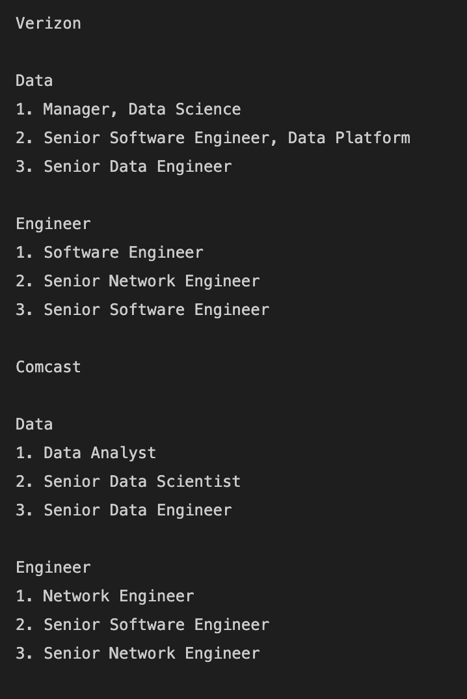

# WebScraper-ChatGPT
## Overview
### The goal of this project is to create a tool that scrapes various company sites for new job postings. This is to help Sales Reps to be able to effectvely sell tools to these companies in areas that they are currently expanding. I used the OpenAI API and Jupyter notebook for this initial iteration. In future interations email capabilities will be added.

## Setup
### 1. In order to use OpenAI's API, you need to setup an account and get your Secret key. To sign up click [here](https://auth0.openai.com/u/signup/identifier?state=hKFo2SA1V0pJRzBPTDBqakV6clg3cmlRR1V3NHhhWjBEWHR2N6Fur3VuaXZlcnNhbC1sb2dpbqN0aWTZIFdQMWo3OGprYU9aZ2VKeFhfRFF4djM0dWxfYnpEN095o2NpZNkgRFJpdnNubTJNdTQyVDNLT3BxZHR3QjNOWXZpSFl6d0Q)

To access your API Key after logging in, click on Personal in the top right corner and click view API Key (shown below): </br>
  </br>
Then click the Create new secret key button. Copy the Secret Key.
### 2. Download the code by cloning [this repository](https://github.com/AkanSri/WebScraper-ChatGPT)
   ```bash
   $ git clone git@github.com:AkanSri/WebScraper-ChatGPT.git
   ```
### 3. Rename the .env.example file to .env and copy your Secret Key into the file. 
### 4. Install 'python dotenv' and 'openai' in your environment
   ```bash
   $ pip install python-dotenv
   $ pip install openai
   ```
    *You may have to restart in order for the system to recognize new installments
### 5. Now you are ready to Run All Cells in the Jupyter Notebook.
    
## Example Input/Output

Input: </br>
  </br>
</br>
  </br>

Output: </br>
  </br>
